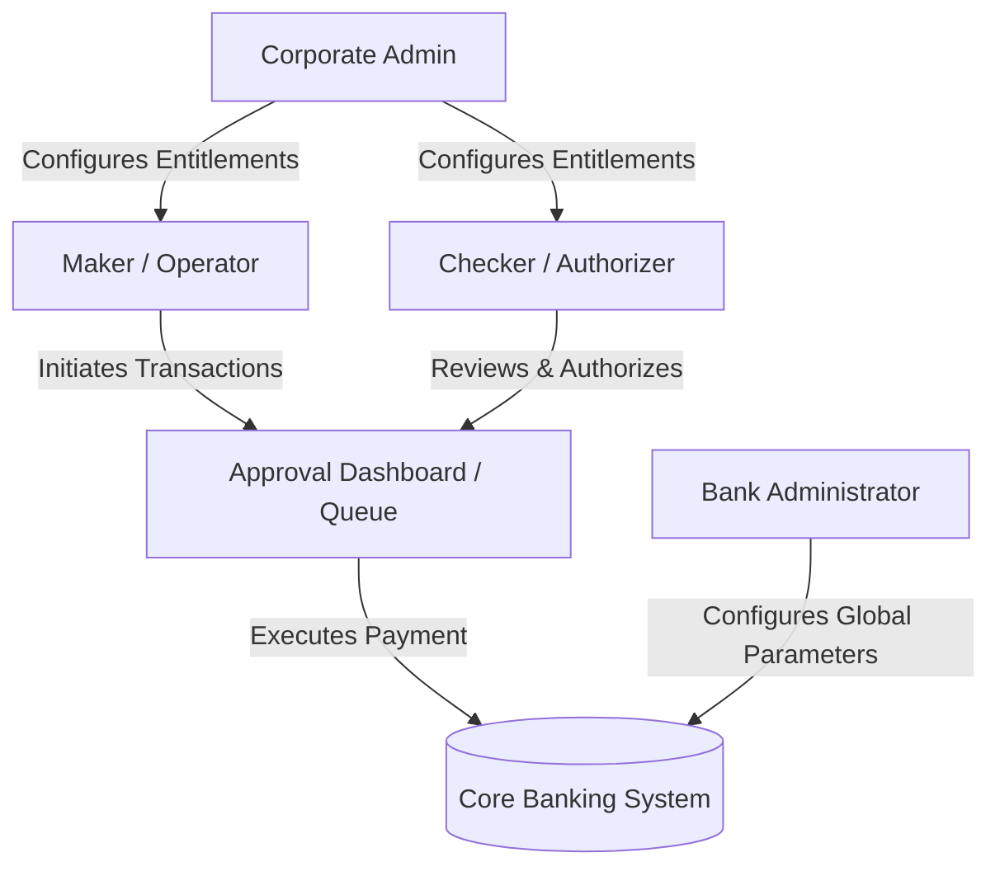
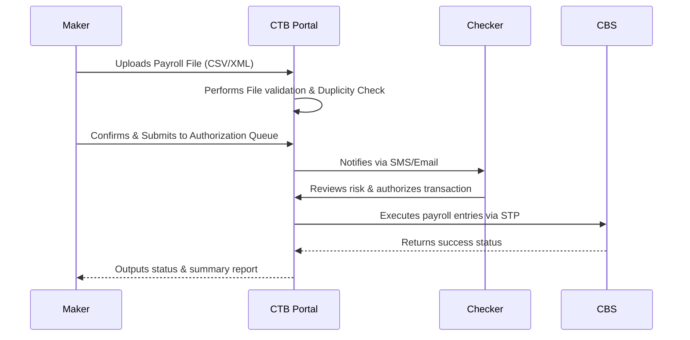

# Business Requirements Specification (BRS)
## Corporate Transaction Banking (CTB) Solution — Shahjalal Islami Bank PLC (SJIBL)

---

## 1. Document Control & Overview

| Project Name | SJIBL Corporate Transaction Banking (CTB) Portal |
| :--- | :--- |
| **Document Type** | Business Requirements Specification (BRS) |
| **Owner** | Project Management Office (PMO) & Transaction Banking Division |
| **Target Audience** | Business Stakeholders, Product Owners, Engineering Team, Shariah Board |

---

## 2. Project Background & Objectives

Shahjalal Islami Bank PLC (SJIBL) is implementing a state-of-the-art **Corporate Transaction Banking (CTB) Portal** to cater to its corporate clientele. The objective of this solution is to provide corporate users with a secure, highly scalable, Shariah-compliant, multi-channel platform to manage their accounts, conduct high-value fund transfers, handle trade finance, streamline cash/liquidity management, and execute bulk operations (such as payroll and distributor collections) with automated workflows.

---

## 3. User Personas & Permissions

The platform supports a granular **Role-Based Access Control (RBAC)** architecture supporting the following primary personas:

### 3.1. Corporate Administrator (Corporate Admin)
* **Objective**: Manage the corporate entity's setup, configure individual user roles, and define authorization structures (maker-checker matrix).
* **Permissions**: User management, terminal IP restrictions, operating time setup, and entitlement configuration. Cannot initiate or approve financial transactions.

### 3.2. Maker (Operator)
* **Objective**: Prepare and submit transactions, uploads, or requests.
* **Permissions**: Initiate own/within-bank/inter-bank transfers, upload bulk payroll files, input Letter of Credit (LC) initiation details, and create beneficiaries.

### 3.3. Checker / Authorizer (Approver)
* **Objective**: Review, audit, and authorize transactions.
* **Permissions**: Approve/reject transactions in the Approval Queue, override low-level warnings, verify maker details, and inspect risk levels.

### 3.4. Bank Administrator (SJIBL Admin)
* **Objective**: Perform system-level configurations and overall environment monitoring.
* **Permissions**: Global configuration, audit log queries, system performance audits, and security configuration changes.

---

## 4. Functional Modules & Requirements

The CTB solution is categorized into seven distinct business domains:

### 4.1. Administration & Compliance
* **Corporate Admin Portal**: Multi-entity setup, user management, and corporate-defined approval workflows.
* **Approval Dashboard**: Central queue for pending transactions awaiting Maker–Checker actions. Transactions are classified by risk levels (Low, Medium, High).
* **Profile Management**: Secure password settings, MFA configuration, and localized operating logs.
* **Shariah Notice**: Global enforcement of Shariah compliance text on investment/profit items.

### 4.2. Accounts & Investments (Shariah-Compliant)
* **Account Management**: Summary of operational current accounts (Al-Wadeeah Current Accounts) and statements (PDF, CSV, XLS).
* **Islamic Investments**: Overview of funded (e.g., Bai-Murabaha, HPSM) and non-funded (e.g., Letters of Guarantee) Shariah-compliant facilities.
* **Term Deposits (TD)**: Multi-tier Mudaraba Term Deposit accounts, including profit schedules and deposit summaries.

### 4.3. Payments & Transfers
* **Fund Transfer Engine**: Support for multiple clearing channels:
  - **Own/Within-Bank**: Instant transfer to SJIBL accounts.
  - **EFTN**: Electronic Fund Transfer for standard batch clearances.
  - **RTGS**: Real-Time Gross Settlement for high-value immediate transfers.
  - **NPSB**: National Payment Switch Bangladesh for real-time inter-bank card/account transfers.
* **Beneficiary Management**: Dynamic directory of payees with Maker-Checker verification.
* **Bill Pay**: Bulk utility payments, mobile recharge, and corporate credit card bill settlement.
* **Bulk Transfer**: Secure file upload system (CSV, XML, ISO20022 format) for mass disbursements (e.g., payroll).

### 4.4. Trade Finance (SWIFT-Compliant)
* **LC Initiation**: Secure workflow for drafting and submitting Letter of Credit (LC) requests to the bank, fully integrated with SWIFT formatting.
* **Import/Export LC Tracker**: Live inquiry dashboard to view Import/Export Letters of Credit, amendments, and SWIFT transmission messages.
* **Import/Export Bill Tracker**: Discrepancy management, document matching, and finance linkage tracking.

### 4.5. Services & Requests
* **Cheque Book Services**: Online request for new cheque books and stop-cheque instructions.
* **Credit Card Management**: Unbilled transaction views and statement downloads.
* **Service Request Tracker**: Dashboard tracking corporate service issues from creation to resolution.

### 4.6. Cash & Liquidity Management
* **Collections & Invoice Management**: Distributor collection systems with hybrid reconciliation capabilities.
* **Virtual Account Management**: Creating virtual accounts to attribute incoming payments to specific distributors or customers.
* **Auto-Sweeps**: Automatic target-balance pooling from child accounts to a master account.

---

## 5. Key Guided Journeys & Workflows

The portal supports five essential guided business journeys:

### Journey 1: Salary Payroll Workflow

### Journey 2: Distributor Collection & Virtual IDs
* **Objective**: Automate collection tracking for dealers.
* **Steps**:
  1. Bank assigns master and virtual IDs to corporate distributor.
  2. Distributors deposit funds using virtual IDs.
  3. CTB engine auto-reconciles deposit details.
  4. Real-time collection dashboards are updated for the corporate finance team.

### Journey 3: Virtual Account Management (VAM)
* **Objective**: Facilitate ledger splitting and automatic ERP reconciliation.
* **Steps**:
  1. Configure Master account link.
  2. Dynamic generation of Virtual accounts for individual clients.
  3. Payments deposited into Virtual accounts auto-consolidate to the Master account.
  4. ERP integration matches statements with client outstanding balances automatically.

### Journey 4: ERP API Payment Integration (STP)
* **Objective**: Enable Straight-Through Processing (STP) directly from corporate ERP.
* **Steps**:
  1. Corporate ERP triggers payment API.
  2. CTB system processes signature and token verification.
  3. Simulated STP execution or request routing to approval queue based on limits.
  4. Real-time status update response posted back to ERP.

### Journey 5: Liquidity Management & Sweep
* **Objective**: Maximize Shariah-compliant yield by centralizing idle balances.
* **Steps**:
  1. Monitor multi-account balances on a unified dashboard.
  2. Identify surplus and deficit positions.
  3. Configure auto-sweep thresholds.
  4. Execute sweeps (e.g., Transfer BDT 10M from Operations to Master account).
  5. Generate liquidity charts showing consolidated group funds.

---

## 6. Shariah Compliance Rules

All operations on the platform must conform to the principles of Islamic Shariah:
1. **Profit vs. Interest**: Interest (Riba) is strictly prohibited. All deposit statements must refer to "Profit" payouts, and investment portals must display expected profits or profit-sharing ratios (PSR) under Mudaraba/Musharaka.
2. **Investment Labeling**: All credit and investment services must label facility limits and transactions as "Investments" rather than "Loans".
3. **Halal Business Filters**: Financing operations (LC, Guarantee) must filter out prohibited sectors (alcohol, gambling, weapons, etc.).

---

## 7. Non-Functional Requirements (NFRs)

### 7.1. Performance & Availability
* **Uptime**: 100% availability through Active-Active application configuration across DC and DR sites.
* **Capacity**: Supports high volume concurrent EOD data fetches and bulk uploads (up to 50,000 payroll lines per batch).

### 7.2. Security & Compliance
* **Encryption**: TLS 1.3 encryption for data in transit; AES-256 for credentials and sensitive data at rest.
* **OWASP Top 10**: Fully protected against SQL Injection, XSS, CSRF, and session hijacking.
* **Session Controls**: Automated session timeout after 15 minutes of idle state. Prevents concurrent sessions from different IP addresses.
* **Audit Trails**: Complete record of all modifications (Maker/Checker actions, logouts, lockouts, view logs) with secure, non-tamperable storage.
