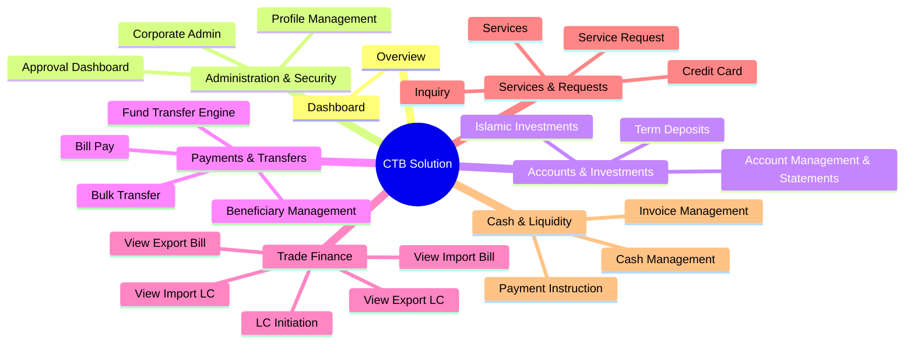

# Feature & Functionality Estimation: Corporate Transaction Banking (CTB) Solution
### Shahjalal Islami Bank PLC (SJIBL)

This document provides a detailed feature estimation and functional breakdown of the Corporate Transaction Banking (CTB) Solution for Shahjalal Islami Bank PLC (SJIBL), compiled from the Request for Proposal (RFP) and the Business Requirements Specification (BRS).

---

## 1. Executive Summary & Core Objectives

The SJIBL Corporate Transaction Banking (CTB) Solution is a state-of-the-art, secure, and Shariah-compliant portal designed to expand the bank's digital corporate banking capabilities. The solution serves Corporates, SMEs, and Supply Chain entities. 

The primary business objectives include:
* **Digital Integration:** Direct integration with corporate Enterprise Resource Planning (ERP) systems via secure APIs and Host-to-Host (H2H) channels (SFTP/APIs).
* **Islamic Finance Integrity:** Global implementation of Shariah-compliant wording, profit-based yields, and non-interest-based terms.
* **Rapid Innovation:** Built-in Rapid Application Development (RAD) low-code/no-code tools to modify workflows, add virtual accounts, and configure rules.
* **Payment Consolidation:** A unified Payment Hub supporting RTGS, BEFTN, NPSB, BACPS, and bulk payroll transfers.

---

## 2. Functional Feature Matrix (23 Modules)

The solution is divided into **7 primary domains** containing **23 functional modules** as defined in the RFP and implemented in the prototype schema structure:

---

### Domain A: Overview
#### 1. Dashboard (`dashboard`)
A central landing page for corporate users featuring modular, responsive widgets that provide real-time updates and quick access.
* **Interactive Balance Analytics:** Displays total BDT equivalent balance, recent inflows/outflows, and historical liquidity flow trends.
* **Pending Task Counters:** Displays visual notifications for actions awaiting the user's role (e.g., Maker/Checker approvals).
* **Guided Journeys Widget:** Prompts users to initiate key business workflows step-by-step (e.g., salary payroll upload).
* **Shariah Compliance Bar:** Prominent compliance notices indicating that all services conform to Islamic finance rules.

---

### Domain B: Administration
#### 2. Corporate Admin (`corporate-admin`)
The control panel for the corporate entity's system administrators to configure localized permissions.
* **Multi-Entity & Multi-Company Support:** Allows a parent company to manage subsidiary user accounts and group accounts under a single login.
* **Role-Based Access Control (RBAC):** Configures user profiles as *Viewer*, *Maker*, *Checker*, *Approver*, or *Admin*.
* **Limit Entitlements:** Sets customized daily transaction limits and per-transaction limits on a user-by-user or module-by-module basis.
* **Security Rules Management:** Enforces terminal IP restrictions, operating time windows, and user lockouts after consecutive failed logins.

#### 3. Approval Dashboard (`approval`)
The central execution interface for Checker and Approver roles to review transactions before final release.
* **Maker-Checker Auditing:** Visualizes who initiated the request, the time of submission, and the audit trail.
* **Risk Categorization:** Flags transactions as *Low*, *Medium*, or *High* based on transaction type, threshold amounts, and beneficiary records.
* **Secure Release Engine:** Approves or rejects transactions with dynamic multi-factor authentication (MFA/OTP) checks.
* **Request Pending Alerts:** Triggers automated notification pipelines (in-app, SMS, email) to remind authorizers of pending approvals.

#### 4. Profile Management (`profile`)
A self-service portal for users to configure personal settings and inspect security logs.
* **2FA Configuration:** Enables/disables SMS, email, or hardware token authentication.
* **Notification Preferences:** Selects alerts for transaction updates (SMS, email, or both).
* **Activity Log Viewer:** Provides a read-only list of the user's own actions (login times, initiated tasks, IP addresses used) to prevent unrecognized access.

---

### Domain C: Accounts & Investments (Shariah-Compliant)
#### 5. Account Management & Statements (`accounts`)
Comprehensive views of operational corporate accounts.
* **Al-Wadeeah Current Accounts:** Lists current account ledger balances, available balances, branches, routing numbers, and SWIFT codes.
* **Account Statement Downloader:** Generates statements dynamically filterable by date ranges, exporting to PDF, CSV, and Excel (XLS) formats.
* **Multicurrency Views:** Displays Nostro and foreign currency accounts (USD, EUR, GBP, SAR, AED) with real-time conversion summaries.

#### 6. Islamic Investments (`investment`)
Overview of active funded and non-funded Shariah-compliant facilities.
* **Facility Tracker:** Tracks mode of finance (e.g., *Bai-Murabaha*, *HPSM*, *Ijarah*, *Musharaka*).
* **Financial Limits Ledger:** Monitors approved limits, outstanding balances, profit/markup rates, and maturity dates.
* **Collateral Details:** View-only portal showing security details and collateral associated with the financing.

#### 7. Term Deposits (`term-deposit`)
Manages Mudaraba-based fixed-term deposit receipts.
* **Deposit Summary:** Displays active Mudaraba Term Deposit Receipts (FDR) and monthly profit scheme deposits.
* **Profit Schedules:** Outlines expected profit rates (instead of interest rates) and maturity timelines.
* **Payout Accounts:** View which operational account is designated for profit distribution at maturity.

---

### Domain D: Payments & Transfers
#### 8. Fund Transfer Engine (`fund-transfer`)
The transaction hub allowing corporate operators to schedule or execute single payments.
* **Multi-Channel Routing:** Automatically routes payments through national payment channels based on value and speed requirements:
  - **Own/Within Bank:** Instant transfer to other SJIBL accounts.
  - **EFTN (Electronic Fund Transfer Network):** Batch inter-bank clearing.
  - **RTGS (Real-Time Gross Settlement):** High-value immediate clearing (usually BDT 100,000+).
  - **NPSB (National Payment Switch Bangladesh):** Real-time inter-bank card/account transfers.
* **Scheduled Payments:** Configures recurring transfers or future-dated transfers.
* **Shariah-Compliance Filter:** Prevents payments to blacklisted companies or prohibited business sectors (e.g., gambling, alcohol).

#### 9. Beneficiary Management (`beneficiary`)
A centralized list of approved payees.
* **Beneficiary Directory:** Saves bank accounts, routing numbers, nicknames, SWIFT codes, and currencies for suppliers/partners.
* **Maker-Checker Setup:** New beneficiary entries require checker verification before becoming eligible for fund transfers.
* **Templates Creation:** Groups beneficiaries into reusable pay lists for repeated transfers.

#### 10. Bill Pay (`bill-pay`)
Corporate bill settlement portal.
* **Utility Integration:** Pays utility bills (DESCO, WASA, Titas Gas) in real time.
* **Telecom Recharge:** Bulk or individual mobile recharge features.
* **Credit Card Bills:** Settles outstanding corporate credit card balances (both SJIBL cards and external credit cards).

#### 11. Bulk Transfer (`bulk-transfer`)
Mass disbursement interface for payroll or vendor payouts.
* **Bulk File Uploader:** Processes payroll and disbursement files in CSV, XML, and ISO 20022 (`pain.001`) formats.
* **Format Validator:** Performs dry-run validations on file structure, row limits (supporting up to 50,000 payroll lines per batch), and account details.
* **Consolidated Approvals:** Batches bulk entries into a single approval task for authorizers.

---

### Domain E: Trade Finance (SWIFT-Compliant)
#### 12. LC Initiation (`lc-initiation`)
Enables digital initiation of Letter of Credit (LC) requests.
* **SWIFT-Compliant Application Form:** Standard fields mapping to SWIFT MT700 format fields.
* **Trade Terms Configurator:** Dropdowns for Incoterms (FOB, CIF, CFR, etc.), shipment/expiry dates, tolerances, and port details.
* **Document Management:** Secure upload of proforma invoices, LCAF (Letter of Credit Authorization Form), and insurance policies.

#### 13. View Import LC (`import-lc`)
Dashboard to track the status of import letters of credit issued by SJIBL.
* **Active LC Summaries:** Displays sight, usance, UPAS, and back-to-back LCs with SWIFT references.
* **Amendment Tracker:** Documents historical changes, value adjustments, and validity extensions.
* **Bank Guarantees:** Monitors active letters of guarantee and performance bonds.

#### 14. View Import Bill (`import-bill`)
Tracks incoming trade bills against issued LCs.
* **Document Matching:** Compares draft details against LC parameters.
* **Discrepancy Action Center:** Alerts corporates of document discrepancies (minor/major) and collects digital acceptance/rejection consent.
* **Payment Due Tracker:** Lists maturity dates and linked financing details.

#### 15. View Export LC (`export-lc`)
Manages incoming export LCs received from foreign buyers.
* **Buyer Summary:** Logs applicant details, issuing banks, advising references, and shipment deadlines.
* **Amendments log:** Real-time visibility of amendments sent by the buyer's bank.

#### 16. View Export Bill (`export-bill`)
Tracks export invoices submitted for collection and realization.
* **Negotiation Ledger:** Logs negotiated/purchased bill values under Islamic principles (e.g., *Bai-as-Sarf*).
* **Realization Tracker:** Live updates when funds are received and credited to the corporate's account.

---

### Domain F: Services & Requests
#### 17. Inquiry (`inquiry`)
A communication interface for non-transactional lookups.
* **Live FX Exchange Rates:** Real-time search of treasury buy/sell rates for currency pairs (e.g., USD/BDT).
* **General Inquiries:** Submits requests for profit rates or balance certificates.

#### 18. Services (`services`)
Basic account servicing utility.
* **Cheque Book Portal:** Requests new cheque books, monitors delivery status, and blocks specific cheque leaves or ranges.
* **Physical Statement Request:** Triggers requests for physical, authenticated bank statements with delivery options (branch collection or mail).
* **Credit Card Requests:** Submits requests for new corporate credit cards.

#### 19. Credit Card (`credit-card`)
Card management dashboard.
* **Corporate Card List:** Displays active corporate credit cards with limits, available credit, and payment due dates.
* **Transaction History:** Displays unbilled transactions and past statements.

#### 20. Service Request (`service-request`)
A ticketing support system.
* **Support Ticket Dashboard:** Allows users to submit, view, and track help desk tickets related to accounts, logins, or errors.
* **Priority Routing:** Categorizes issues by priority (Low, Medium, High, Urgent) to meet SLA response targets.

---

### Domain G: Cash & Liquidity Management
#### 21. Cash Management (`cash-management`)
Enables optimal positioning of corporate cash flows.
* **Zero Balance Sweeps (ZBA):** Automatically transfers funds from child/subsidiary accounts to a master account to concentrate liquidity.
* **Auto-Sweep Rule Engine:** Defines trigger thresholds, target pooling schedules (Daily EOD, Weekly, Monthly), and float days.
* **Virtual Account Collection:** Views collections coming through virtual account paths with automated ledger updating.

#### 22. Invoice Management (`invoice`)
A billing and receivables matching module.
* **Invoice Directory:** Uploads invoices issued to buyers.
* **Hybrid Collections:** Matches payments from multiple payment instruments (cheques, online deposits, cash) to a single invoice, or maps one instrument to multiple invoices.
* **Virtual Account Linking:** Assigns unique virtual collection accounts to invoices to simplify distributor matching.

#### 23. Payment Instruction (`payment-instruction`)
Manages custom non-clearing bank instructions.
* **Instrument Designer:** Enables corporates to design and print their own payment instruments (like pay orders or demand drafts) for local/remote printing.
* **Instruction Tracker:** Tracks the status of print orders, collections, and cancellations.

---

## 3. High-Value Guided Journeys & Workflows

The solution supports 5 key guided business journeys designed to automate high-touch financial workflows:

### Journey 1: Salary Payroll Workflow (Bulk Disbursement)
* **Objective:** Streamline monthly employee salary distribution.
* **Steps:**
  1. Corporate payroll officer uploads employee salary file (CSV/XML/ISO20022).
  2. CTB Portal performs file validation (duplicate row checks, negative amount checks, structure checks).
  3. Maker reviews validation errors and submits to the approval queue.
  4. Checker/Approver receives notification and reviews payroll totals and risk indicators.
  5. Checker authorizes the release using MFA/OTP.
  6. CTB Portal initiates Straight-Through Processing (STP) through the Payment Hub (cleared via EFTN or RTGS).
  7. Funds are credited to employee accounts, and a execution report is posted to the portal.

### Journey 2: Distributor Collection (Receivables Automation)
* **Objective:** Automatically identify which dealer deposited which collection amount.
* **Steps:**
  1. Corporate finance team assigns unique Virtual IDs or virtual reference numbers to dealers/distributors.
  2. Distributors deposit funds via branches, agent banking, or internet banking using their assigned Virtual ID.
  3. The system maps incoming deposits directly to the dealer's ID.
  4. Real-time collection dashboards are updated, and auto-reconciliation clears outstanding distributor records in the dashboard.

### Journey 3: Virtual Account Management (VAM)
* **Objective:** Enable ledger splitting and automatic ERP reconciliation.
* **Steps:**
  1. Corporate admin links a master account.
  2. Generates multiple virtual accounts mapped to the master account.
  3. Assigns these virtual accounts to distinct customers/projects.
  4. Incoming payments are deposited into these virtual accounts and consolidated into the master account.
  5. The portal generates matching statement reports which can be exported directly to the corporate ERP.

### Journey 4: ERP API Payment Integration (STP)
* **Objective:** Allow transaction initiation directly from the client's internal ERP system (e.g., SAP, Oracle).
* **Steps:**
  1. Client ERP connects to the SJIBL API Gateway.
  2. The ERP initiates a payment request payload (validating signatures and security tokens).
  3. If within pre-configured API thresholds, the transaction executes via STP. If above limits, it routes to the CTB portal's approval queue for human authorization.
  4. The system logs the API transaction and sends real-time status webhooks back to the ERP.

### Journey 5: Liquidity Management & Sweep
* **Objective:** Pool surplus balances across group accounts to maximize yields.
* **Steps:**
  1. Consolidated cash balance visualization across all company accounts on the dashboard.
  2. The system flags deficit and surplus accounts.
  3. Corporate admin sets auto-sweep parameters (e.g., "maintain minimum BDT 500,000 balance, sweep any excess to Master Account").
  4. The system executes sweeps automatically at EOD or on-demand.
  5. Generates liquidity tracking charts showing pooled balances.

---

## 4. Shariah Compliance Rules

As an Islamic banking solution, the system enforces the following rules globally:
1. **Riba Elimination:** The word "Interest" is completely banned. All references to yields or payout statements must use "Profit" or "Expected Profit Rate" (under Mudaraba/Musharaka agreements).
2. **Investment Nomenclature:** Credit and financing terms must be labeled as "Investments" or "Facilities" rather than "Loans".
3. **Halal Business Filters:** Trade transactions (LCs, Guarantees) and invoice payments must filter out prohibited industries (e.g., alcohol, tobacco, weapons, gambling, pork-related industries) during creation or validation checks.

---

## 5. Technical Architecture & Integration Requirements

To deploy this CTB solution in a bank environment, several technical interfaces are required:

| Component | Integration Protocol | Purpose |
| :--- | :--- | :--- |
| **Core Banking System (CBS)** | SOAP Web Services / REST APIs | Balance inquiries, account details, ledger posting. |
| **Payment Hub / Clearing Networks** | ISO 20022 / SQL staging | Inter-bank routing to EFTN, RTGS, NPSB, and BACPS. |
| **AML & Sanctions Screening** | REST APIs / Real-time queue | Screens beneficiaries against national/international blacklists. |
| **Card Management System (CMS)** | ISO 8583 format | Queries corporate credit card statements and unbilled balances. |
| **Corporate ERP Systems** | REST APIs / SFTP Host-to-Host | Import invoices, post payroll batches, export statement files. |
| **Active Directory / LDAP / IAM** | SAML / OIDC / LDAP | Manages bank-office administrator credentials and user directories. |
| **MFA Gateways** | SMS Gateway, SMTP, TOTP Authenticator | Generates and sends OTP tokens for transaction authorization. |
| **Hardware Security Module (HSM)** | PKCS#11 | Secures transaction signing, encryption keys, and digital signatures. |

---

## 6. Prototype vs. Production Implementation Gap Analysis

The existing codebase implements a high-fidelity **prototype (~95% frontend completeness)**. Here is how it compares to the requirements of a production environment:

| Feature Area | Prototype State (Current) | Production Staging Requirements |
| :--- | :--- | :--- |
| **Routing & Shell** | Complete React layout using `@tanstack/react-router`. Responsive dashboard with functional side navigation. | Integrates with single-sign-on (SSO) and redirects users dynamically based on active session tokens. |
| **Data Engine** | Fully structured metadata schemas for all 23 modules. LocalStorage CRUD engine maintains state across reloads. | Interfaces with a secure backend API (Node.js/Spring Boot) connected to a relational DB (e.g., PostgreSQL). |
| **Workflows & Approvals** | Interactive buttons allow changing statuses (Approve/Reject) on local records. | Integrates with a BPMN workflow engine (e.g., Camunda) to orchestrate complex multi-step corporate approvals. |
| **Transaction Execution** | Mocks the submission and alerts. | Straight-Through Processing (STP) pipelines that post actual debits/credits via the Core Banking System. |
| **Security & Signing** | Form fields exist for OTP input. | Hardened integration with SMS gateways and Hardware Security Modules (HSM) for cryptographic signing. |
| **RAD Engine** | Built-in metadata configurations exist in `moduleSchema.ts`. | A dedicated administrative UI for bank admins to edit schemas, modify layouts, and deploy new APIs on the fly. |
